[技术解码 | 腾讯云视频插帧技术](https://cloud.tencent.com/developer/article/1813604)

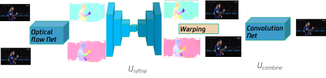

双帧输入--> PWC-Net预测光流 --> Unet光流refine --> 双帧warping --> CNN拟合插入帧
直觉上是用大量数据迭代训练出来的，突破口是光流预测的精度

**Depth-Aware Video Frame Interpolation**    2019

* Depth-Aware Flow Projection
  同一点有多个光流通过时，与传统方式不同（取平均），重点拟合近距离物体的光流效果更好
  $$\displaystyle F_{t\rightarrow 0}(x)=-t\cdot\frac{\sum_{y\in S(x)}w_0(y)\cdot F_{0\rightarrow 1}(y)}{\sum_{y\in S(x)}w_0(y)}, \quad w_0(y)=\frac{1}{D_0(y)} $$

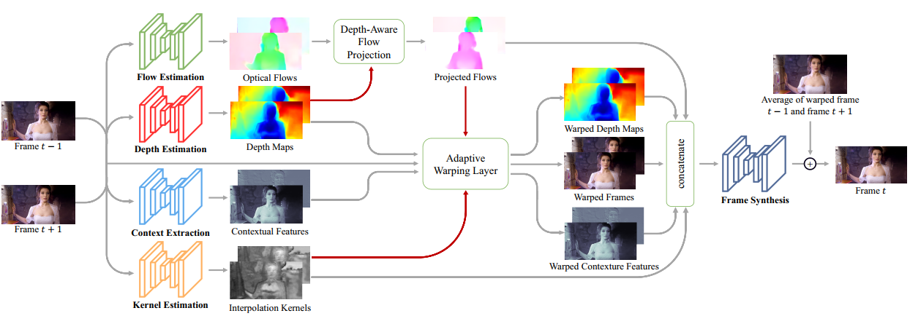

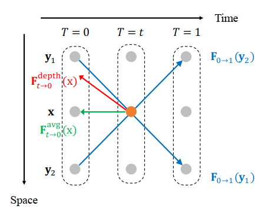

**AdaCoF: Adaptive Collaboration of Flows for Video Frame Interpolation**     2020

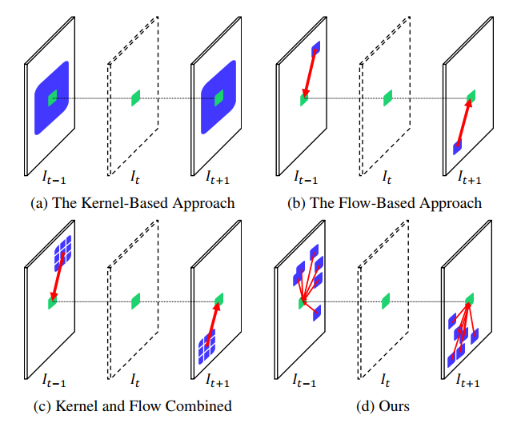

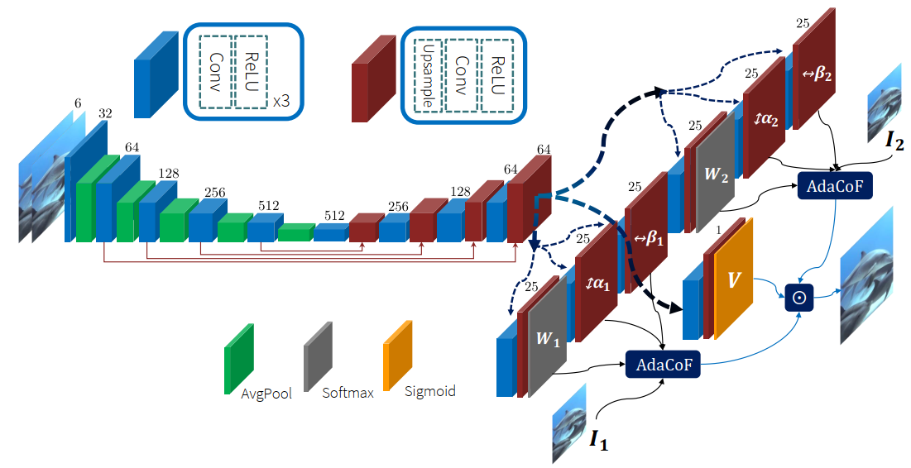

$$\displaystyle \hat{I}(i,j)=\sum_{k=0}^{F-1}\sum_{l=0}^{F-1}W_{i,j}^{(k,l)}(i,j)I(i+dk+\alpha_{i,j}^{(k,l)}, j+dl+\beta_{i,j}^{(k,l)})$$
F=5时，$$W,\alpha,\beta \in R^{W\times H \times 25}$$, d为膨胀尺度

**CDFI: Compression-Driven Network Design for Frame Interpolation**  2021

* 压缩驱动的网络设计，以AdaCof为实例，实现10倍压缩
* 稀疏优化pruning思想
* 以压缩架构为baseline，加入feature pyramid和path selection，提升性能

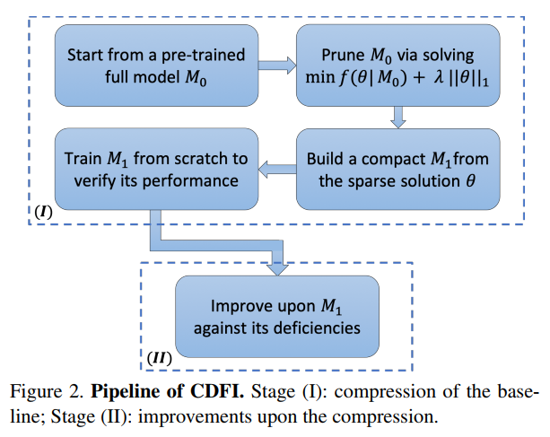

模型压缩步骤：
1）预训练无压缩模型M0
2）基于权重参数L1稀疏约束的模型重训练
3）根据各层非0权重参数比例降低通道数，形成compact模型M1
4）从头训练M1

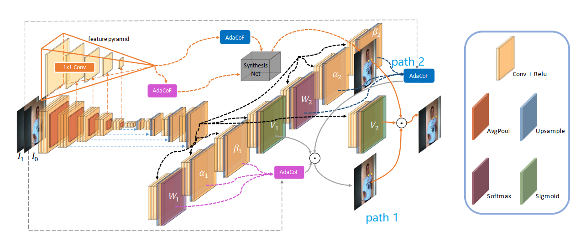

**RIFE: Real-Time Intermediate Flow Estimation for Video Frame Interpolation**   2021

* coarse-to-fine IFNet，直接预测中间光流$$F_{t\rightarrow 0}, F_{t\rightarrow 1}$$，不计算$$F_{0\rightarrow 1}, F_{1\rightarrow 0}$$
* teacher-student distillation scheme，student model and the teacher model are jointly trained from scratch   

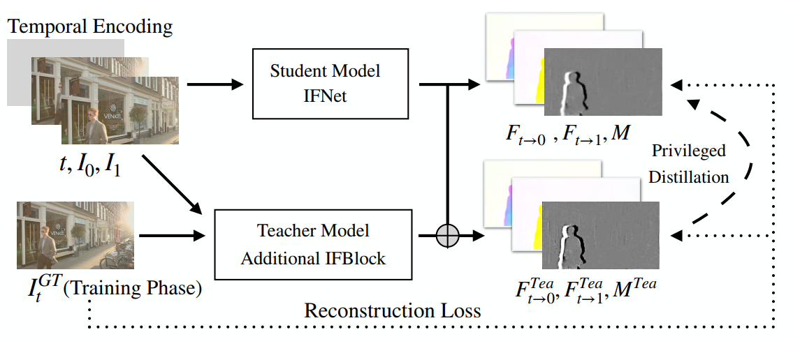

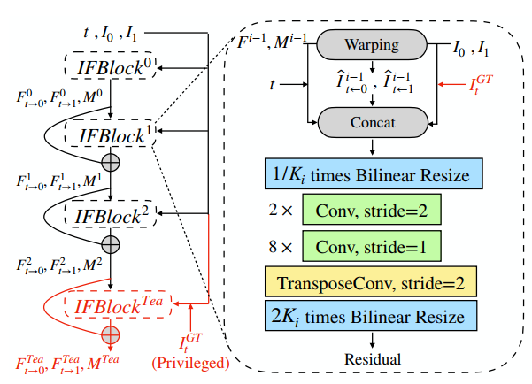

teacher model额外多出IFBlock^Tea^
多分辨率由粗到细结构
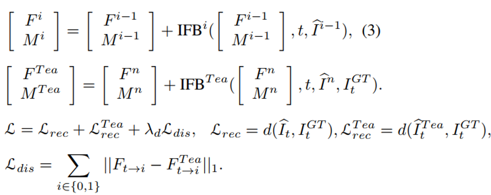

交替训练过程中，teacher model的loss没有最后一项
teacher model的输入包含GT，可以训练出更精确的光流，用于指导student model

**FLAVR: Flow-Agnostic Video Representations for Fast Frame Interpolation**  	2021

* 3D时空卷积网络，不预测光流
* channel gating module有助于提高对运动区域的注意力
* 插帧任务的模型encode可用于下游任务（action recognition, optical flow estimation, motion magnification）

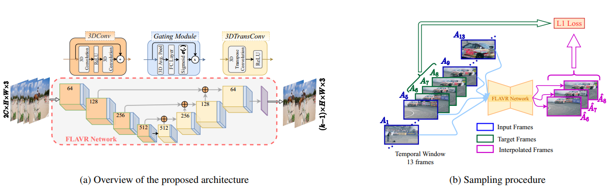

**Super SloMo: High Quality Estimation of Multiple Intermediate Frames for Video Interpolation**   2018

* 任意倍数，时间点插帧
* CNN网络预测双向光流$$F_{1\rightarrow 0}, F_{0\rightarrow 1}$$，t时刻光流通过基于时间距离的双线性插值得到$$\hat{F}_{t\rightarrow 0}, \hat{F}_{t\rightarrow 1}$$​，g为基于当前t时刻光流对输入双帧warp的结果，蓝色CNN网络用于refine光流，并预测visibility maps（缓解遮挡效应） 

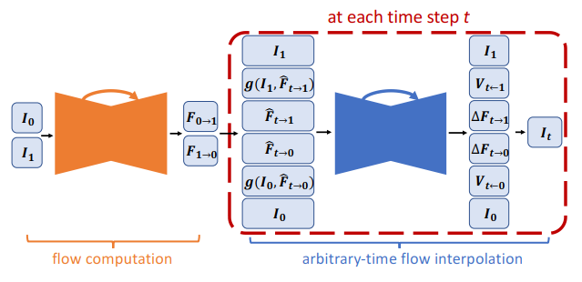

**Video Frame Interpolation Via Residue Refinement**  RRIN  2020

* residue learning  for refinement

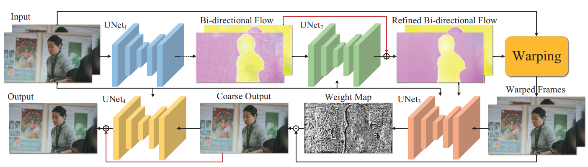

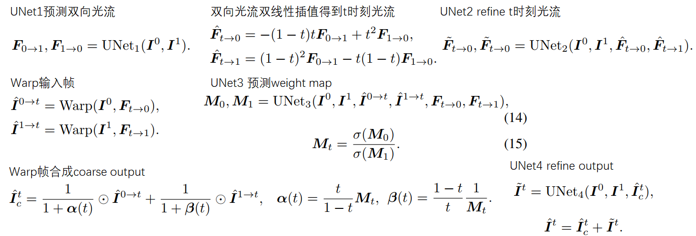

**BMBC:Bilateral Motion Estimation with Bilateral Cost Volume for Video Interpolation**  2020

* 

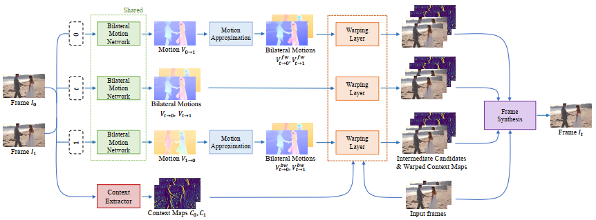

overview，双边运动估计网络通过不同方式得到t时刻的双向光流，输入帧和上下文map通过光流warp，最后通过动态局部混合滤波器合成得到输出帧

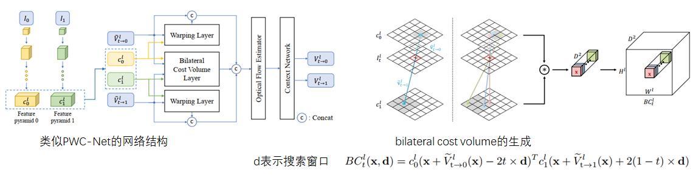

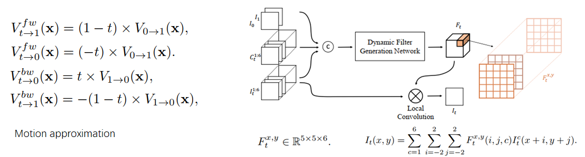

