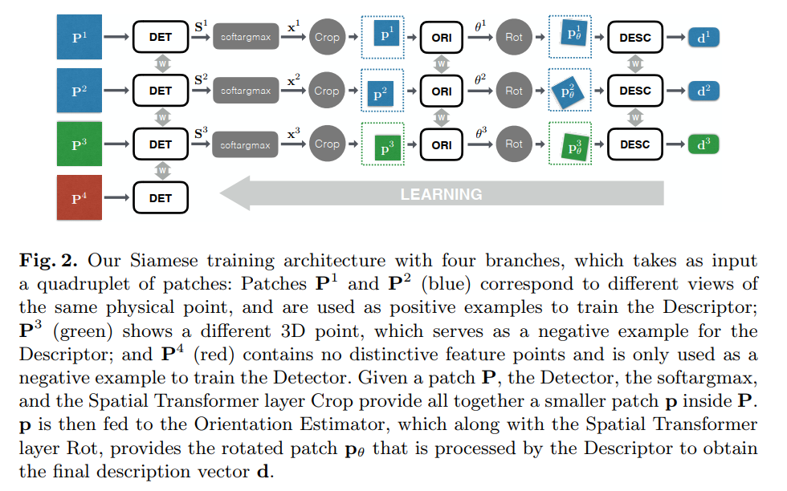
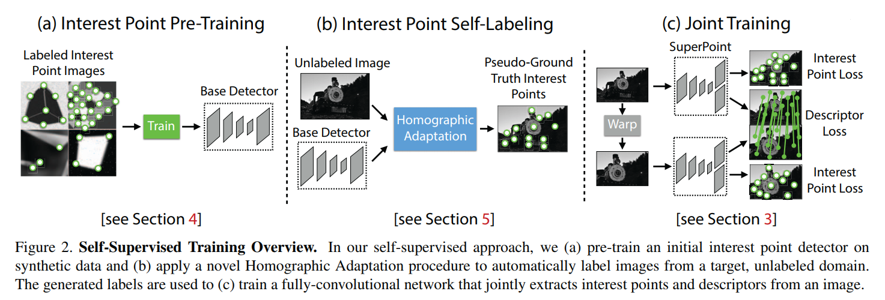
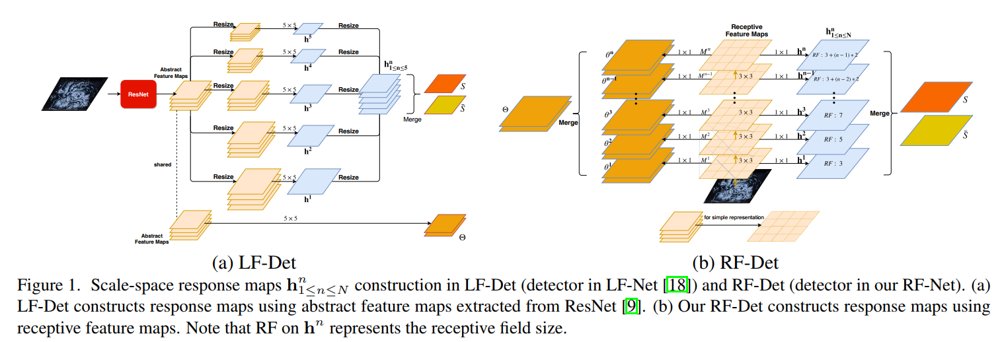
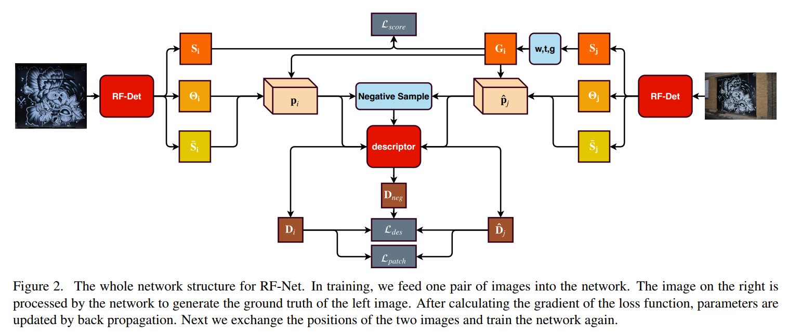

LIFT --> SuperPoint --> LF-Net --> RF-Net

* LIFT -- infer工作流组成：1) det 2) orientation 3) descriptor
  * 训练过程从后往前，先训后面的part，固定后训前面的
  * 训练样本为四元patch，$$P^1$$到$$P^4$$，P1,P2是来自同一个3D点在不同视角下的图像，P3是不同3D点投影回来的图像块，P4是不包含任何特征点的图像块
  * Desc训练使用P1,P2,P3，Ori训练使用P1,P2，Det使用所有

* SuperPoint: 1）合成数据集上训练MagicPoint；2）MagicPoint + Homographic Adaption生成pseudo ground truth；3）pseudo ground truth被用来训练SuperPoint

* LF-Net：1）无监督；2）detector预测x,y, orientation，scale（scale通过resize成N个scale（N=5）的feature map来实现）

* RF-Net
  * detector设计：基于感受野不同的feature map进行训练，Figure1(b)中RF maps的大小应该是一样的，感受野因为卷积深度变深而增大。
  * Descriptor结构与LF-Net相同
  * Description loss ：improve the hard loss by a neighbor mask  两个patch的质心距离超过阈值才认为是非匹配点对，用于计算$$D_{ng}$$

