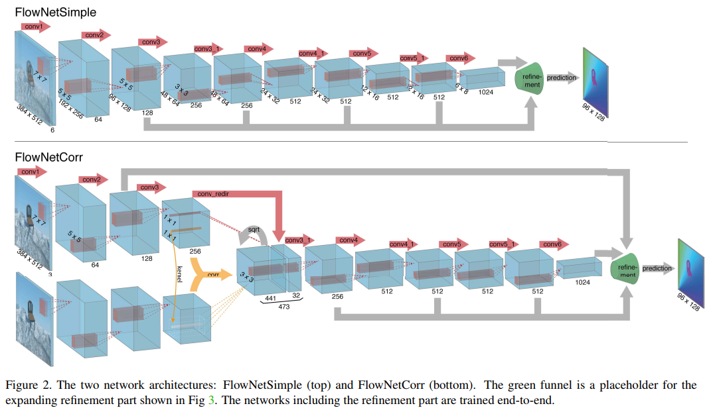
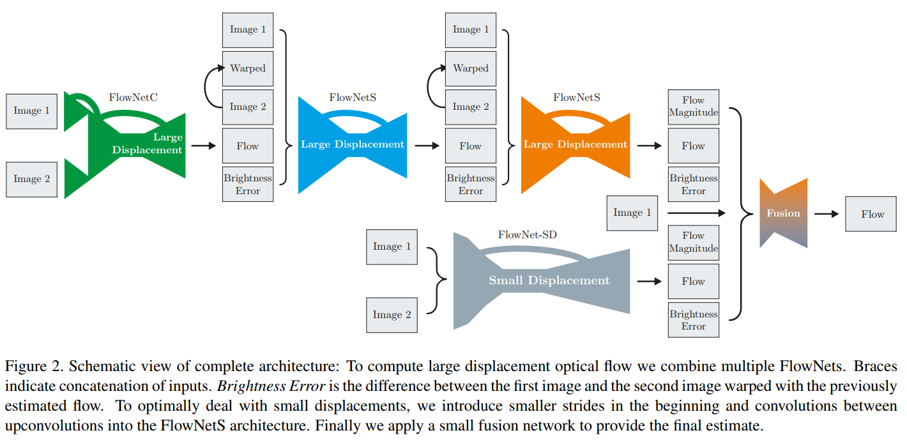
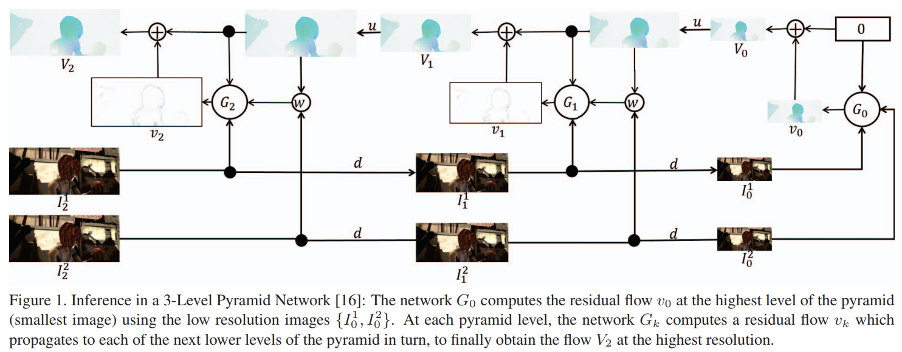
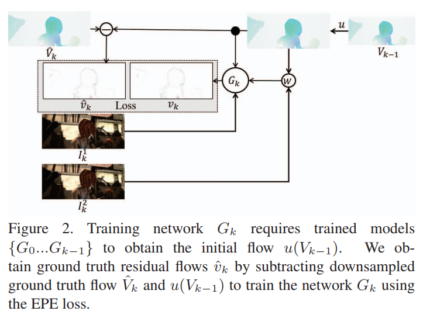
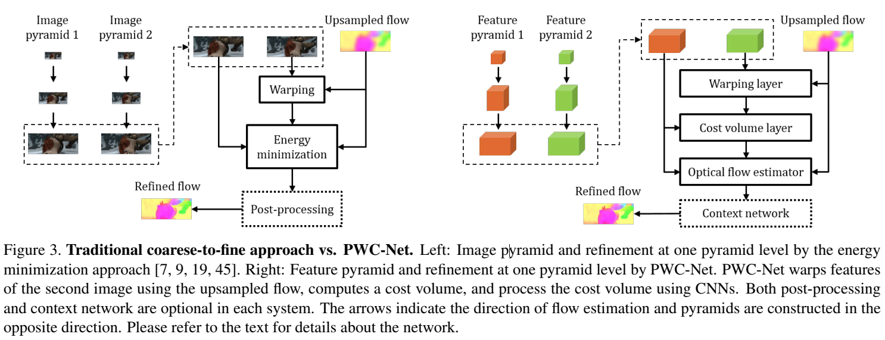

**FlowNet: Learning Optical Flow with Convolutional Networks**  FlowNetS and FlowNetC

**FlowNet 2.0: Evolution of Optical Flow Estimation with Deep Networks**  FlowNet2

* FlowNet网络的堆叠
* 平衡计算时间和精度的通道数调整
* 对FlowNet-S进行调整得到的FlowNet-SD：去掉第一层的stride=2；把7x7和5x5卷积核改成多个堆叠的3x3卷积核；反卷积添加额外的卷积层。FlowNet-SD为小位移分支网络

 **Optical Flow Estimation using a Spatial Pyramid Network**  SPyNet

* 用 spatial pyramid 的方式，from coarse to fine 的方法来解决 large motion的问题
* FlowNet系列需要预测任意大的运动向量，SPyNet中pyramid的形式使每一个金字塔级的位移都在1个pixel左右，局部卷积就可以很好的预测。

**PWC-Net: CNNs for Optical Flow Using Pyramid, Warping, and Cost Volume**  

https://zhuanlan.zhihu.com/p/67302545

1. feature map比图像本身更鲁棒，PWC-Net learns feature pyramids  
2. 利用cost volume；use the features to construct a cost volume that stores the matching costs for associating a pixel with its corresponding pixels at the next frame **代价容量存储了两帧图像之间对应像素的匹配代价**
3. warping layer和 cost volume layer都是固定操作，无可学习参数；
4. PWC-Net uses a context network to exploit contextual information to refine the optical flow；上下文信息提取利用了dilated convolutions；
5. running at about 35 fps on Sintel resolution (1024×436) images  

