**Deep Iterative Frame Interpolation for Full-frame Video Stabilization**  DIFRINT 2019

* end-to-end; unsupervised 
* full-frame video stabilization 
* 训练过程：中间帧$$f_i$$随机空间移动生成伪GT--$$f_s$$，$$f_{i-1}$$/$$f_{i+1}$$通过PWC-Net推理warp到$$f_s$$生成$$f_W^-$$/$$f_W^+$$，经过U-Net生成$$f_{int}$$，$$f_i$$ warp to $$f_{int}$$，经过ResNet生成$$\hat{f_i}$$；
* 推理过程：$$f_{i-1}$$/$$f_{i+1}$$通过PWC-Net推理warp到中间状态$$f_W^-$$/$$f_W^+$$，后续与训练一致；
* 可通过自定义迭代次数和skip parameter 来适应不同的需求。
* drawbacks (from other article)
  * 如不稳定视频中包含大的晃动，估计的光流会不够准确导致生成帧的扭曲和鬼影（尤其是在运动物体的边缘）

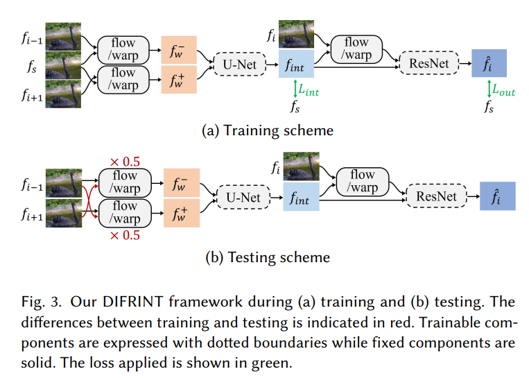

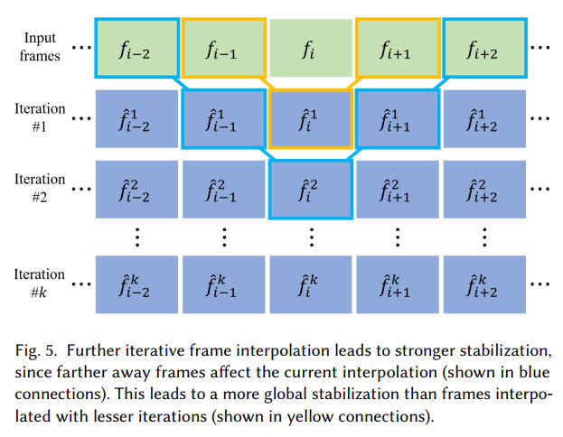

**Channel Attention Is All You Need for Video Frame Interpolation**  CAIN 2020

* end-to-end
* 不需要运动估计（如光流），使用 PixelShuffle 和 channel attention 完成视频插帧

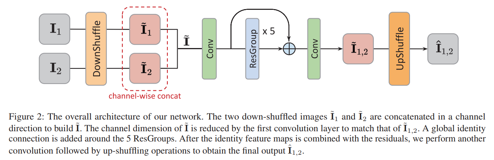

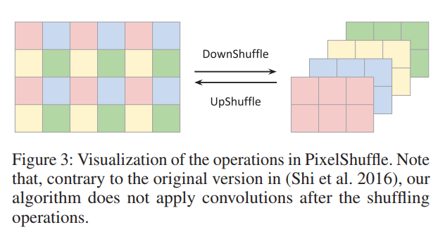

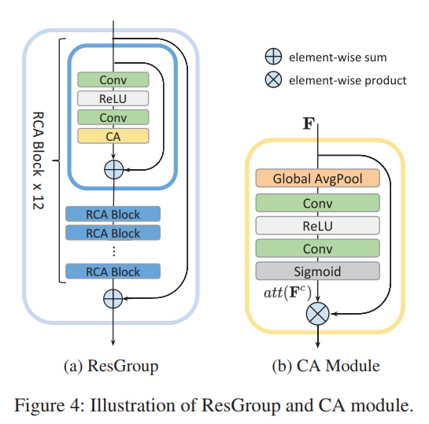

**Deep Motion Blind Video Stabilization**  2021

* 原始的DeepStab数据集contain a significant non-overlapping field-of-view, and a perspective mismatch，不利于生成模型的训练
* 改进版本的CAIN用于生成视角稳定的视频数据，方法名为Dataset Generation Pipeline (DGP) ，经过DGP处理过的DeepStab数据用于文中生成模型的训练
* code和文中提及的supplementary material应该还没放出，推理速度说是比最快的还能提升3倍，具体数据未提及。

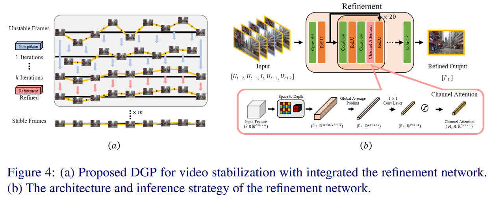

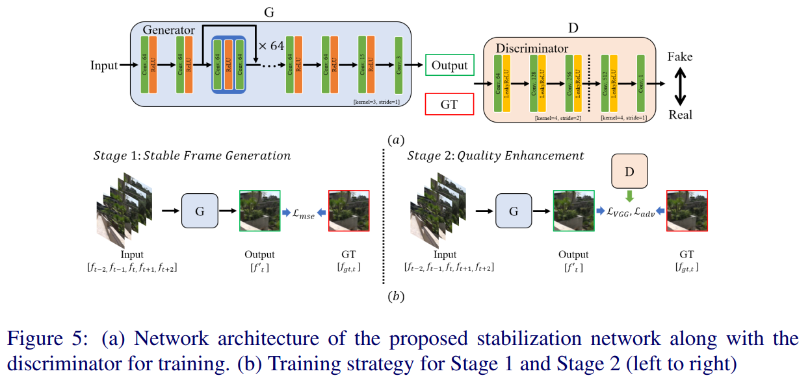

**Out-of-boundary View Synthesis Towards Full-Frame Video Stabilization** 2021

* novelty
  * 定义概念affinity，外推光流边界，从而可以warp对应的pixel到外边界，补全原来需要crop的区域
  * plug-and-play module，可用于接在已知的warping-based stabilizers后面用于提升性能
* 两步对齐：1）DUT完成粗对齐；2）图像补零扩充后，结合mask，通过PWC-Net得到valid区域的光流，Affinity Estination Network输出refined flow和Affinity Kernel；3）光流外推。 
* supplementary material  和 code 还未公布，运行时间未提及

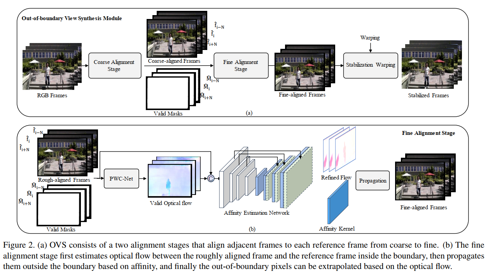

困惑：

* 网络输出和外推公式如下，定义有点不明，红框内容按照定义计算为0
  * 一种理解方式是 $$a,b\neq0$$是a,b不能同时取到0，而分母的求和应该去掉这个限制，具体定义要等代码放出后验证

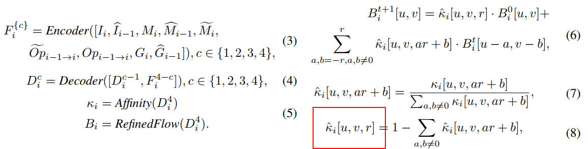

* loss定义中$$\epsilon$$用于稳定性意义不明

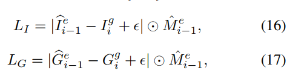

**Hybrid Neural Fusion for Full-frame Video Stabilization** 2021

* novelty: learning-based hybrid-space fusion that alleviates artifacts caused by optical flow inaccuracy and fastmoving objects  
* hybrid fusion method: both feature and image level
* Video stabilization methods typically consist of three stages: 1) motion estimation, 2) motion smoothing, and **3) frame warping/rendering**  此文前两步基于现有方法，主要贡献在第三步
* Motion estimation and smoothing: get backward dense warping field  $$F_{k^t->k^s}$$  ，其中s为源帧，t为目标帧
  * Jiyang Yu and Ravi Ramamoorthi. Learning video stabilization using optical flow. In CVPR, 2020. 1, 2, 3, 4, 7, 8  
* Optical flow estimation: To recover the missing pixels, project the corresponding pixels from nearby frames to the target stabilized frame {$$F_{n^s->k^s}$$} $$n\in\Omega_k$$  从相邻帧到目标帧
  * RAFT ——Zachary Teed and Jia Deng. RAFT: Recurrent all-pairs field transforms for optical flow. In ECCV, 2020. 4 
* 图像空间融合——重影ghosting artifacts，失灵glitch artifacts；特征域融合——模糊效应；--->>混合域融合
* loss functions include the L1 and VGG perceptual losses 
  * $$\mathcal{L}=||I_{k^t}-\hat{I}_{k^t}||_1+\sum_l\lambda_l||\psi_l(I_{k^t})-\psi_l(\hat{I}_{k^t})||_1$$
* Limitations
  * Wobble 相机或物体的快速运动效果变差，卷帘门效应
  * Visible seams  由多帧不同的白平衡和曝光校正引起
  * Temporal flicker and distortion  -- large non-rigid occlusion and inconstant foreground/background motion (e.g., selfie videos)  
  * Speed 离线应用 1 second/frame  

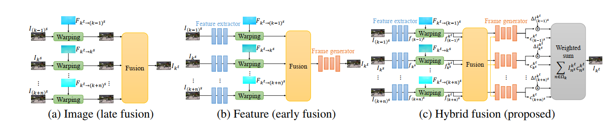

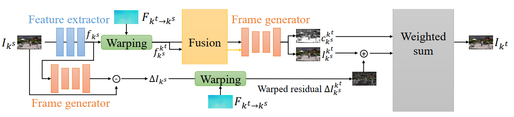

$$\Delta I_{k^s}$$用于恢复高频细节，类似残差；Feature extractor consists of 8 ResNet blocks with a stride of 1  生成所有$$f_{k^s}$$ ，warping到target frame生成$$f_{k^s}^{k^t}$$，所有$$f_{k^s}^{k^t}$$经过Fusion得到$$f_{CNN}^{k^t}$$，Fusion结构如下图，其中$$G_\theta$$与Frame generator结构相同（类似U-Net），$$M_{n^s}^{k^t}$$为warping mask，定义flow consistency error为 $$e_{n^s}(\pmb{p}) = ||F_{k^s->n^s}(\pmb{p})+F_{n^s->k^s}(\pmb{p}+F_{k^s->n^s})||_2$$ ，$$e_{n^s}^{k^t}$$为warping到frame k上的$$e_{n^s}$$；$$f_{k^s}^{k^t}$$和$$f_{CNN}^{k^t}$$联合输入Frame generator得到输出帧$$I_{n^s}^{k^t}$$和置信度map $$C_{n^s}^{k^t}$$， 权重求和$$I_{k^t}=\displaystyle \sum_{n\in\Omega_k}I_{n^s}^{k^t}C_{n^s}^{k^t}$$

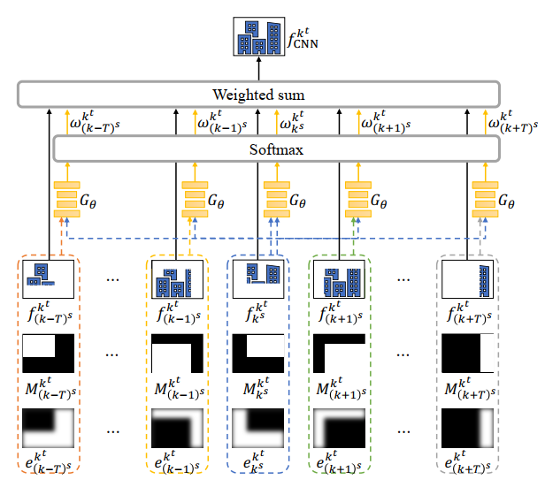

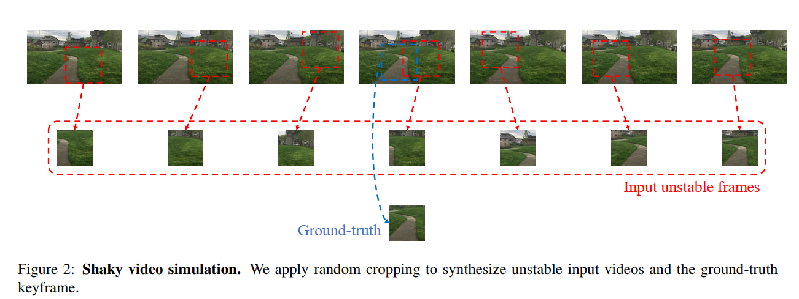

训练集样本生成方式

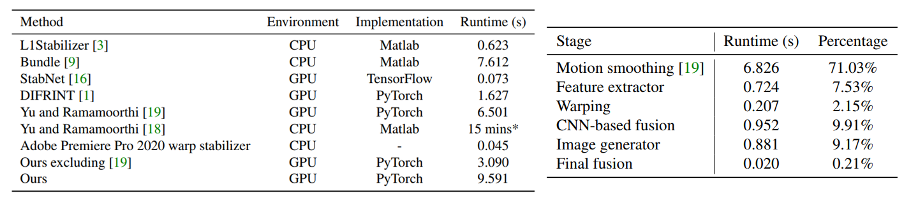

耗时，根据文献19的说法，单帧耗时570ms，所以文中测试视频为10帧左右？仅计算文中方法的fusion阶段为3s

Nvidia Tesla V100 GPU  and i7-8550U CPU  

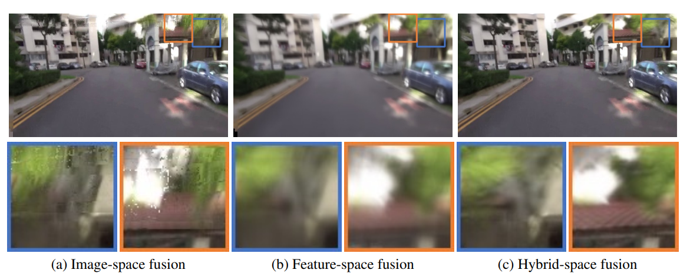

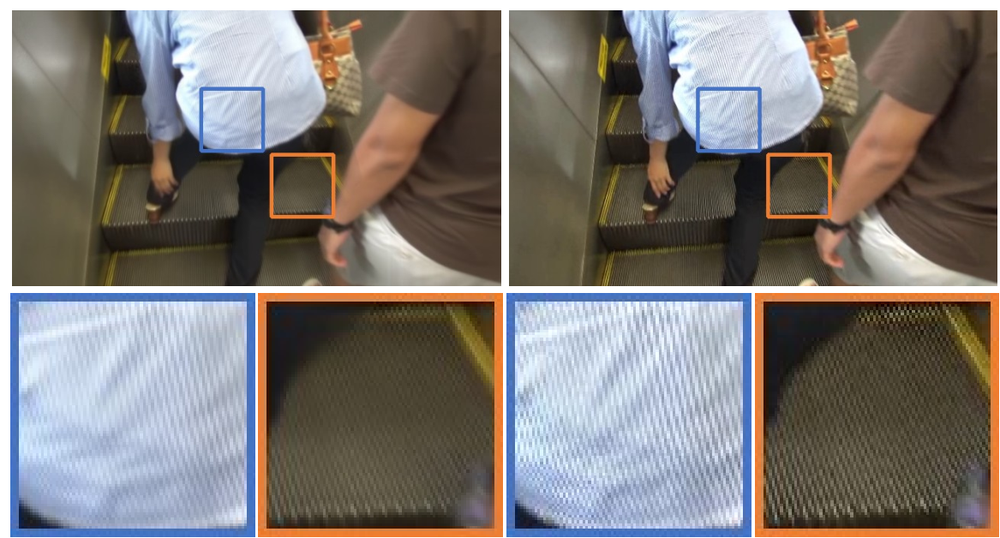

引入高频信息复原的必要性

复现过程中发现需要降级的cuda版本和cudnn，cudnn下载页面无法打开

