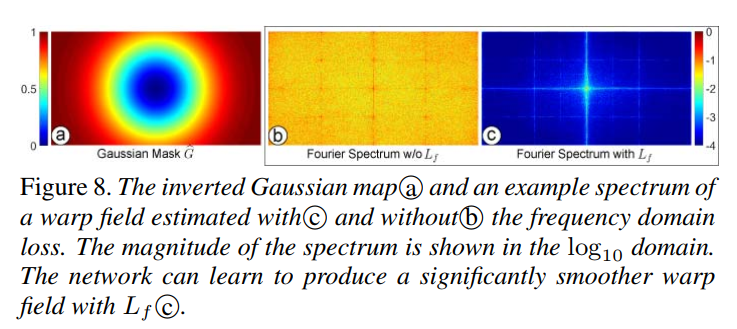
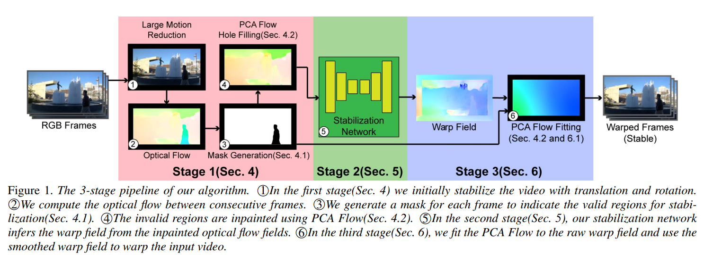
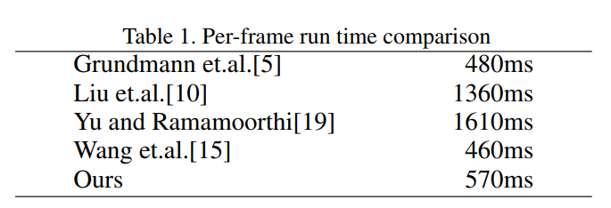

**Learning Video Stabilization Using Optical Flow**  2020

* 现有基于光流方法的问题：1）对于有遮挡区域和缺乏纹理的区域，光流估计不准确；2）计算复杂度较高，一些基于优化目标函数的方法需要对每个不同的视频进行一次优化迭代过程，耗时长
* 本文贡献点
  * 基于光流的视频稳定网络，takes the optical flow fields as the input and produces a pixel-wise warp field
  *  Frequency domain regularized training -- requency domain loss   
  * 利用光流的主成分获得moving occlusion and optical flow inaccuracy的鲁棒性

* 训练loss
  * 两阶段训练，第一阶段$$L_1=L_m+10*L_f$$，第二阶段$$L_2=L_m$$
  * $$L_m=\displaystyle \sum_{n=1}^{N-1}\sum_i\left\|\hat{\pmb{p}}_{i,n}-\hat{\pmb{q}}_{j,n+1}\right\|$$
    * 经过warp之后，$$\hat{p}_{i,n}$$为第n帧的第i个点，$$\hat{q}_{j,n+1}$$为第n+1帧的第j个点，两点通过光流匹配，此loss限制相邻帧的匹配点距离最小
  * $$L_f=\displaystyle \sum_{n=2}^{N-1}\left\|\hat{\pmb{G}}\cdot\mathcal{F}\pmb{W}_n\right\|_2$$
    * 频域loss，傅里叶变换之后与inverted Gaussian map相乘，目的在于增强低频能量，抑制中高频能量，高频与噪声有关，中频与local distortion有关
    *  $$\hat{\pmb{G}}=(max(\pmb{G})-\pmb{G})/max(\pmb{G})$$，图示如下

流程：1）预平移和旋转。SURF features 计算仿射变换，临近帧滑动平均用于平滑。2）FlowNet2计算光流。3）生成有效光流区域的mask，invalid regions包含几种情况：与帧运动不同的运动物体，运动物体的边界，缺乏运动信息的色彩一致性区域，由视差引起的静止物体的位移；4）根据valid regions拟合PCA光流，用于填充无mask区域；5）从20帧的输入光流infer19个warp fields；6）对于网络输出的warp field再进行一次PCA光流拟合用于平滑warp field。

单帧运行时间   RTX2080Ti GPU and i7-8700K CPU  

