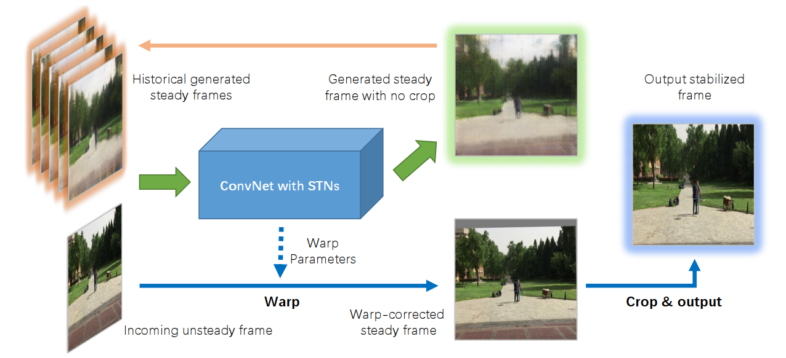
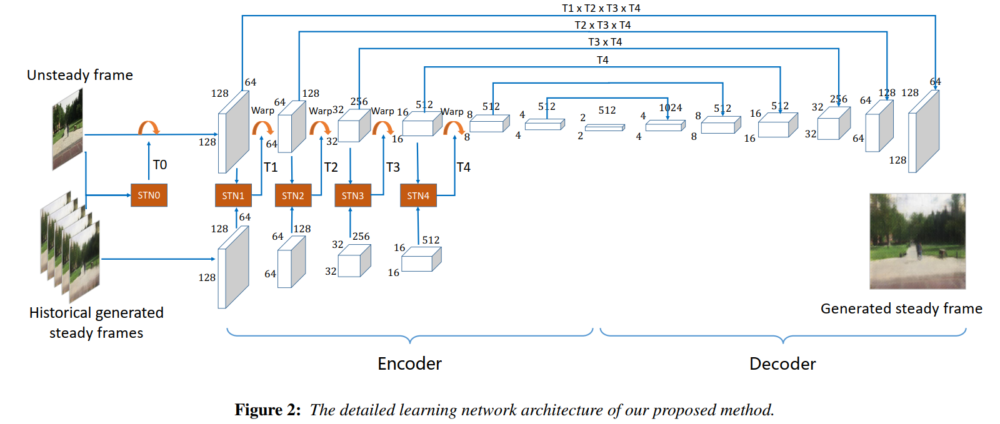
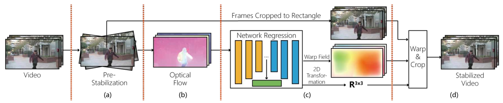
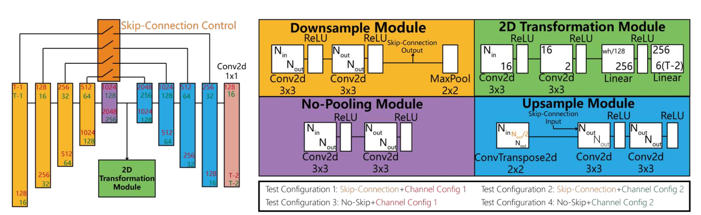
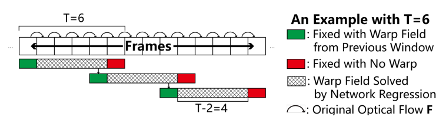

**Deep Video Stabilization Using Adversarial Networks**  2018

* 利用生成对抗网络预测每一帧的仿射变换达到视频稳定的效果，网络输入与StabNet类似
  * 没有预测单应矩阵的原因是，仿射变换更有利于网络收敛，且尝试训练单应矩阵未发现性能指标的提升
  * 常规方法是基于特征跟踪平滑摄像机路径，此方法是预测每一帧的仿射变换矩阵
* online，end-to-end，无公开代码
* 数据集--成对的稳定和非稳定视频共44组，DeepStab数据集
* 生成网络有两个输出，T0-T4用于warp输入帧，经过crop之后生成稳像，另一个输出steady frame用于后续的条件输入
* 训练优势：1）目标就是让生成帧与稳定帧尽量接近，不需要设计hand-craft feature和对应的目标函数；2）生成网络输出的steady frame没有warp原图后的黑边，减少对网络预测的影响。
* 生成器loss——L1 loss and the vgg19-net feature similarity， D1，D2为两个判别器
   $$L_{stab}(I^t_{gt}, I_s^t)=\lambda_1||Vgg^19(I^t_{gt})-Vgg^19(I_s^t)||+\lambda_2||I^t_{gt}-I_s^t||$$
  $$L_G=L_{stab}+D_1(G^t,I_s^t)+D_2(A^t,I_s^t)$$
* 判别器loss
  $$L_{D_1}=||D_1(G^t,I_{gt}^t)||_2^2+||1-D_1(G^t,I_s^t)||_2^2$$
  $$L_{D_2}=||D_2(A^t,I_{gt}^t)||_2^2+||1-D_2(A^t,I_s^t)||_2^2$$
* limit
  * 只全局仿射变换，忽略了局部变换
  * 未针对所有视频帧生成全局稳定路径，时间相干性弱

STN consists of a light convolutional localization network，summarize the current feature map to the size of 4×4×16，followed by a fully connected layer    to regress the feature to a 2 × 3 affine transformation matrix 
选取过去1秒内等时间间距的5帧作为历史帧，如对于30fps的视频，$$S^t=\{I_s^{t-7},I_s^{t-13},I_s^{t-19},I_s^{t-25},I_s^{t-31}\}$$，对应GT为$$G^t=\{I_{gt}^{t-7},I_{gt}^{t-13},I_{gt}^{t-19},I_{gt}^{t-25},I_{gt}^{t-31}\}$$

**Robust Video Stabilization by Optimization in CNN Weight Space**  2019

* 网络是基于光流预测2D affine transformation 和 pixel-wise的warp field
* CNN网络求解优化问题的优势
  * pixel-wise的warp field的求解是高维大规模非凸优化问题，直接在图像域很难求解，CNN优化可行
  * 通过loss中对应正则化的设计，可以对错误光流有较强的鲁棒性

* 滑动窗T=60，耗时为计算光流的时间和本文CNN的优化时间（因为不是固定权重，针对每个视频流都需要优化），离线方法，requires about 30min to stabilize a 300-frame video on a GTX1080Ti graphics card
* T帧图像，输入T-1维光流，预测中间T-2帧的H和W  

* Loss设计
  * 由双向光流$$F_t,\bar{F_t}$$得到前后帧的对应点
    $$p_{j,t+1}=p_{i,t}+F_t(p_{i,t}),\qquad p_{l,t}=p_{k,t+1}+\bar{F_t}(p_{k,t+1})$$
  * 预测二维仿射变换$$H_t$$  以及per-pixel warp field $$W_t$$
    $$\hat{p}_{i,t}=H_tp_{i,t}+W_t(p_{i,t})\qquad\hat{p}_{j,t+1}=H_{t+1}p_{j,t+1}+W_{t+1}(p_{j,t+1})$$
  * 最小化warped pixel positions的欧式距离
    $$E_o(W,H)=\frac{1}{wh(T-1)}\displaystyle\sum_{t=1}^{T-1}(\displaystyle\sum_{i=1}^{wh}||\hat{p}_{i,t}-\hat{p}_{j,t+1}||^2+\displaystyle\sum_{k=1}^{wh}||\hat{p}_{l,t}-\hat{p}_{k,t+1}||^2)$$
  * 正则化设计，所有点的位置可以用四个角点的线性插值表示，如果全图的warp是线性的，warp之后线性插值的权重不变
    $$P_t=DS_t \qquad \Delta{P_t}=D\Delta{S_t}$$
  * 最小化线性warp——$$\Delta{P_t}$$与预测warp——$$W_t$$ 的差异
    $$||W_t-D\Delta{S_t}||_2=0$$
    $$\Delta{S_t}=(D^TD)^{-1}D^TW_t$$
    $$E_r(W)=W_t-\Delta{P_t}=W_t-D(D^TD)^{-1}D^TW_t$$
  * 对光流较大的地方正则化加强（光流出错影响大）
    $$E_p=F_t^2+\bar{F_t}^2$$
  * final loss
    $$\displaystyle\min_{W,H}E_o(W,H)+\lambda||E_p\cdot{E_r(W)}||_1$$

* 
