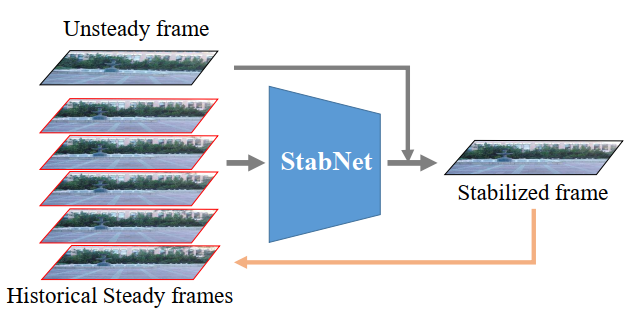
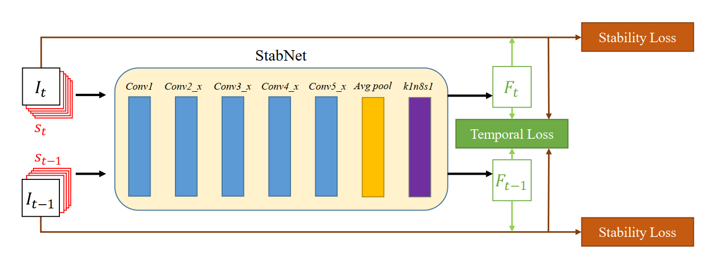
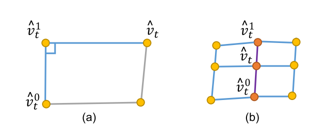
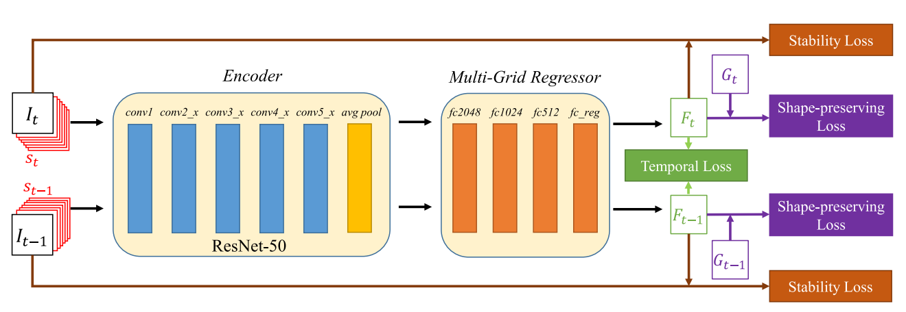
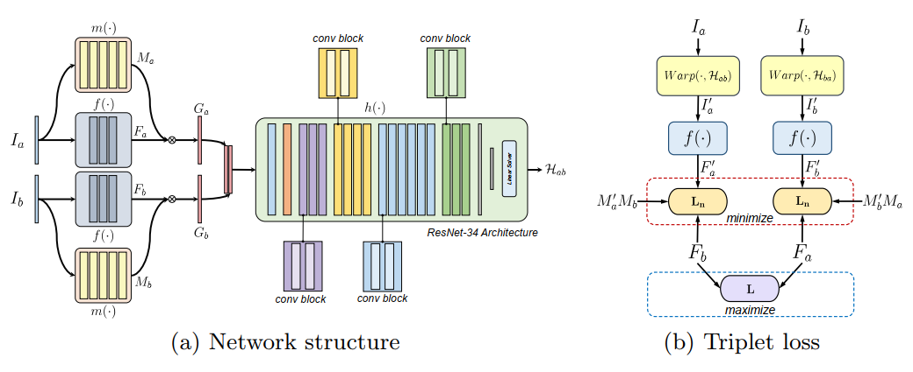
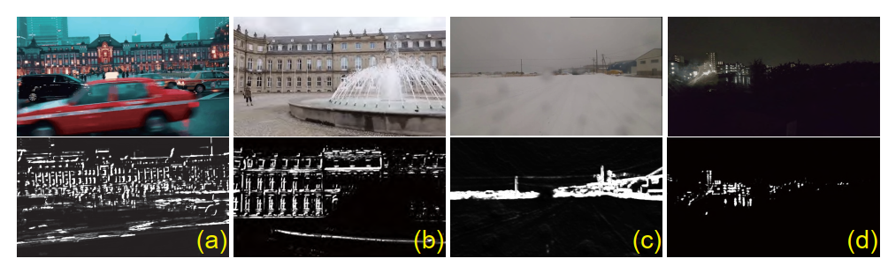
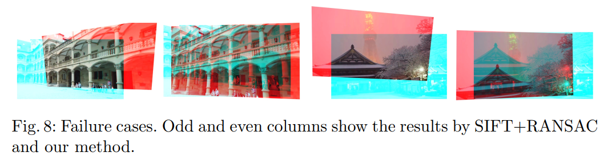

**Deep Online Video Stabilization**  2018 StabNet

* Novelty
  * 在线视频稳定。常用方案是离线式的，通过特征点匹配平滑相机路径；此文基于历史帧预测当前帧的形变（单应矩阵），不显式表示相机路径。
  * 速度提升，93 fps
  * 能够处理夜间和模糊视频
  * 构建了DeepStab公开数据集（稳定和非稳定视频对，共60对）

* 网络输入$$S_t$$为历史帧，训练过程为gt，预测过程为历史稳定帧，30fps的视频的历史帧采样为$$S^t=\{I_s^{t-30},I_s^{t-24},I_s^{t-18},I_s^{t-12},I_s^{t-6}\}$$
* Loss
  $$L=\displaystyle\sum_{i\in{\{t,t-1\}}}L_{stab}(F_i,I_i)+\lambda{L_{temp}}(F_t,F_{t-1},I_t,I_{t-1})$$
  * stability loss
    $$L_{stab}(F_t,I_t)=L_{pixel}(F_t,I_t)+\alpha{L_{feature}}(F_t,I_t)$$
    $$L_{pixel}(F_t,I_t)=\frac{1}{D}||I_t^{'}-F_t*I_t||_2^2$$    MSE
    $$L_{feature}(F_t,I_t)=\frac{1}{m}\displaystyle\sum_{i=1}^m||p_t^{'i}-F_t*p_t^i||_2^2$$   m对匹配特征点的定位损失项
  * Temporal loss
    $$L_{temp}(F_t,F_{t-1},I_t,I_{t-1})=\frac{1}{D}||F_t*I_t-w(F_{t-1}*I_{t-1})||_2^2$$
    $$w(\cdot)$$是基于光流的warp操作，文中光流是通过TV-L1 algorithm计算的，光流和$$w(\cdot)$$基于稳定视频帧（GT）计算得出
* limit
  * 全局单应性预测，无法处理更复杂的变换
  * 剧烈运动或者近距离的前景物体，方法可能失效。

**Deep Online Video Stabilization With Multi-Grid Warping Transformation Learning**   2019 StabNet(multi-grid)

* 与StabNet-2018相比
  * mesh-grid warping transformation——未处理比全局单应性更复杂的变换
  * 图像分为4*4的mesh，预测所有网格顶点的偏移量
  * 历史帧的选取不是等时间间隔的，$$S^t=\{I_s^{t-32},I_s^{t-16},I_s^{t-8},I_s^{t-4},I_s^{t-2},I_s^{t-1}\}$$
  * run at 35.5 FPS on a NVIDIA GTX 1080Ti graphic card  
* Loss
  $$L=\displaystyle\sum_{i\in{\{t,t-1\}}}L_{stab}(F_i,I_i)+L_{shape}(F_i,G_i)+L_{temp}(F_t,F_{t-1},I_t,I_{t-1})$$
  * 第一、三项的定义与StabNet-2018相同
  * shape-preserving loss
    $$L_{intra}(F_t,G_t)=\frac{1}{N}\displaystyle\sum_{\hat{\nu}_t}||\hat{\nu}_t-\hat{\nu}_t^1-sR\vec{\nu}_t^{01}||_2^2,\qquad 
    R=\left[ \begin{matrix}0&1\\-1&0 \end{matrix} \right], \qquad \vec{\nu}_t^{01}=\hat{\nu}_t^0-\hat{\nu}_t^1, \qquad
    s=||\nu_t-\nu_t^1||/||\nu_t^0-\nu_t^1||$$
    $$\{\nu_t, \nu_t^0, \nu_t^1\} \subset g_t, \qquad \{\hat{\nu}_t, \hat{\nu}_t^0, \hat{\nu}_t^1\} \subset{f_t*g_t}$$
    $$L_{inter}(F_t,G_t)=\frac{1}{M}\displaystyle\sum_{<\hat{\nu}_t^0, \hat{\nu}_t, \hat{\nu}_t^1>}||\hat{\nu}_t^1-\hat{\nu}_t-(\hat{\nu}_t-\hat{\nu}_t^0)||_2^2$$
    如图所示，$$L_{intra}$$中三个点是同一个网格上的相邻点，loss作用尽量保持正交的形状；$$L_{inter}$$中三个点是同一条边上的相邻点，loss作用尽量保持平行的形状。

* 

**Content-Aware Unsupervised Deep Homography Estimation**  2020

* 不是做的视频流的稳定， 是预测图像对的单应矩阵
* Novelty
  * 受到RANSAC的启发,  网络预测异常值mask，异常值主要是动态前景，mask同时具有attention map（低纹理区域和弱光区域权值低）和异常值拒绝器的作用
  * loss计算在feature map层面，比图像域计算更稳定；非监督训练；novel triplet loss

* Loss
  $$\displaystyle\min_{m,f,h}L_n(I_a^{'},I_b)+L_n(I_b^{'},I_a)-\lambda{L}(I_a,I_b)+\mu||\mathcal{H}_{ab}\mathcal{H}_{ba}-\mathcal{I}||_2^2$$
  $L_n(I_a^{'},I_b)=\frac{\sum_iM_a^{'}M_b\cdot||F_a^{'}-F_b||_1}{\sum_iM_a^{'}M_b}$  $$I_a^{'}=Warp(I_a,\mathcal{H}_{ab}), F_a^{'}=f(I_a^{'}), M_a^{'}=Warp(M_a,\mathcal{H}_{ab})$$  warp前后的feature map对齐
  $$L(I_a,I_b)=||F_a-F_b||_1$$   此项反映两原始输入图像并未对齐的事实，并防止网络预测收敛到$$F_a^{'}=F_b=0$$的情况
  最后一项保证两个单应矩阵互为逆矩阵
* Limit
  * 此方法适合small baseline场景，large baseline场景可能失效，原因可能为网络的感知区域有限。

* 

