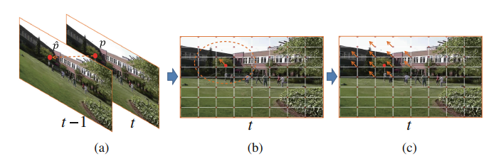

**Bundled Camera Paths for Video Stabilization**  2013

* single global path无法处理rolling shutter，网格化，预测单个网格的路径，并从时间和空间上联合优化实现时空连续性。
* 离线算法，处理720p的视频流，速度约为2.5fps
* 传统的基于数据项和正则项构造目标函数，使用迭代方法（如梯度下降）最小化目标函数求解
* Method
  * 每帧提取400-600 SURF特征点，相邻两帧的特征点做好匹配
  * 相邻帧单网格单应矩阵$$F_i(t)$$预测
    data term  $$E_d(\hat V)=\sum_p \left\| \hat V_pw_p- \hat p \right\|^2$$  已知$$p=V_pw_p, w_p=\left[ w_p^1,w_p^2,w_p^3,w_p^4 \right]^T$$，假设warp之后网格顶点与特征点依然满足原来的双线性插值权重；
    Shape-preserving term   $$E_s(\hat V)=\sum_{\hat{\nu}_t}\left\|\hat{\nu}-\hat{\nu}_1-sR_{90}(\hat{\nu}_0-\hat{\nu}_1)\right\|^2,\qquad 
    R_{90}=\left[ \begin{matrix}0&1\\-1&0 \end{matrix} \right], \qquad s=\left\|\nu-\nu_1\right\|/\left\|\nu_0-\nu_1\right\|$$
    energy  $$E(\hat V)=E_d(\hat V)+\alpha E_s(\hat V)$$
    根据计算得到的warp之后的网格点，得到每个网格的单应矩阵  $$\hat V_i=F_i(t)V_i$$
    迭代过程中计算  $$e=e_h+e_s,\quad e_h=\frac{1}{n}\sum_p\left\| F_p \times p-\hat p \right\|^2, \quad e_s=\beta \sum_{j\in \Omega_i}\left\| F_i-F_j \right\|^2$$，$$\alpha$$自适应调整
  * 网格路径时空联合优化
    * 相机姿态路径
      $$C_i(t)=C_i(t-1)F_i(t-1), \quad C_i(t)=F_i(0)F_i(1)...F_i(t-1)$$
    * 时间尺度优化
      $$\mathcal O(\left\{ P(t) \right\})=\sum_t\left( \left\| P(t)-C(t) \right\|^2+\lambda_t\sum_{r\in\Omega_t}\omega_{t,r}(C)\cdot \left\| P(t)-P(r) \right\|^2 \right)$$
      双边滤波  $$\omega_{t,r}(C)=G_t(\left\|r-t \right\|)\cdot G_m(\left\|C(r)-C(t) \right\|)$$
    * 空间尺度优化 Optimizing Bundled Paths 
      $$\displaystyle \sum_i \mathcal O(\left\{ P(t) \right\}) + \sum_i\sum_{j\in N(i)}\left\| P_i(t)-P_j(t) \right\|^2 $$

**MeshFlow: Minimum Latency Online Video Stabilization**  2016

* DUT的前置
* 离线和实时稳像方法都有
* 480p的视频，单帧耗时20ms，约50fps
* FAST提取特征点 ，KLT计算特征点光流，图像切分为16*16网格，每个格点由领域eclipse的运动矢量决定，中值滤波过滤候选者；
  * FAST只能提取点的位置，没有其他描述信息（如尺度和方向），KLT是否可以自动把不同帧的key point配对？

* 对全图，另一个中值滤波用于移除特异点

* 每个格点的运动轨迹通过Predicted Adaptive Path Smoothing（PAPS）进行平滑
  * offline
    $$\mathcal O(P(t))=\sum_t\left( \left\| P(t)-C(t) \right\|^2+\lambda_t\sum_{r\in\Omega_t}\omega_{t,r} \left\| P(t)-P(r) \right\|^2 \right)$$
    高斯权重  $$\omega_{t,r}=exp(-\left\| r-t \right\|^2/(\Omega_t/3)^2)$$
  * online
    $$\mathcal O(P^{(\xi)}(t))=\displaystyle\sum_{t\in\Phi}\left( \left\| P^{(\xi)}(t)-C(t) \right\|^2+\lambda_t\sum_{t\in\Phi,r\in\Omega_t}\omega_{t,r} \left\| P^{(\xi)}(t)-P^{(\xi)}(r) \right\|^2 \right)+\beta \sum_{t\in\Phi}\left\| P^{(\xi)}(t-1)-P^{(\xi-1)}(t-1) \right\|^2$$
    $$\Phi$$为时间缓冲区

* meshflow主要的流程为“估计光流-->估计关键点并筛选出关键点的光流-->基于关键点光流得到mesh中每一个格点的motion/轨迹-->进行轨迹平滑并得到平滑后的轨迹/每一个格点的motion-->基于motion得到满足平滑轨迹的视频帧

**DUT: Learning Video Stabilization by Simply Watching Unstable Videos**  2020

* 在meshflow的框架下，将其中所有的模块都deep化：
  * LK光流---->PWCNet
  * SIFT关键点----->RFNet
  * 基于Median Filters的轨迹平滑------>CNN-based Motion Propagation  
  * Predicted Adaptive Path Smoothing（PAPS）迭代平滑----->CNN-based Trajectory Smoothing   
* 无监督训练基于：continuity in motion and the consistency of keypoints and grid vertices before and after stabilization
* 三个网络，keypoint detection (KD), motion propagation (MP), and trajectory smoothing (TS)  

method

* Keypoint Detection(KD)
  * RF-Net得到匹配特征点（512个），PWCNet计算光流，从而得到每一帧的特征点及其运动向量信息
    $$\left\{ (p_{ij}, m_{ij})|\forall i\in[1,E-1], \forall j\in[1,L] \right\}, \quad E:frame, L:point$$
* Motion Propagation(MP)
  * meshFlow中通过中值滤波得到网格顶点的位移
  * 先估计全局单应 $$H_i^c$$，特征点的残留位移向量 $$\Delta m_{ij}=p_{ij}+m_{ij}-H_i^c(p_{ij}), \quad \Delta m_{ij}:[L\times 2]$$
  * 所有网格顶点到特征点的距离  $$d_{ijk}=p_{ij}-v_{ik}, \quad k=1,...,MN, \quad d_{ijk}:[MN\times L\times 2]$$
  * $$d_{ijk}$$走上分支，$$\Delta m_{ij}$$走下分支，预测网格顶点的残差位移，$$\Delta n_{ik}=MP(\Delta m_{ij}, d_ijk), \quad \Delta n_{ik}\in [MN,1,2]$$
  * $$n_{ik}=\Delta n_{ik}+(H_i^c(v_{ik})-v_{ik})$$
* Trajectory Smoothing (TS)  
  * 未经平滑的轨迹 $$T_k=\left\{ t_{ik}=\sum_{m=1}^in_{nk}|\forall i\in[1,E] \right\}, \quad T_k:[2,E,M,N]$$
  * 类似meshFlow，常规平滑的目标函数
    $$L_{ts}=\displaystyle \sum_{i=1}^{E-1}(\left\| \hat{T_{ik}}-T_{ik} \right\|_2^2 + \lambda \sum_{j\in\Omega_i}w_{ij}\left\| \hat{T_{ik}}-\hat{T_{jk}} \right\|_2^2)$$
    迭代公式  $$\displaystyle\hat{T_{ik}}^t=\frac{T_{ik}+\lambda \sum_{j\in\Omega_i}w_{ij}\hat{T_{jk}}^{t-1}}{1+\lambda \sum_{j\in\Omega_i}w_{ij}}$$
    $$w_{ij}$$为固定kernel weight(如高斯权重)， TS网络根据$$T_k$$预测kernel weight
  * 网络T-Block中均为三维卷积核，同时处理时空平滑

**Depth-Aware Multi-Grid Deep Homography Estimation with Contextual Correlation**   2021

* 单一单应性方法的缺陷
  * 无法处理不同深度引起的视差
  * 基于特征的方法依赖于特征的数量和分布，低纹理区域失效
  * pixel-based方法在重叠率较低的场景（大baseline运动）失效
* 现有multi-grid单应性方法的问题
  * 对图像质量和特征分布的要求更高，在低纹理或低分辨率情形下通常效果比单一单应性方法更差
* It takes about 96ms to align the images of 512×512 resolution  
* Novelty
  * 为解决低纹理或低分辨率情形下，稳定模型需要挖掘long-range feature correlation，设计了contextual correlation layer (CCL) ，与cost volume相比，在准确率，参数量和计算速度上都有提升
  * depth-aware shape-preserved loss，使基于形状保持的正则项可以更好的发挥作用
* Method
  * Feature Extraction: vgg提取特征
  * Pyramid Layer：3层金子塔，第i层金字塔为scale i到scale N的合成，所有scale resize到scale i 的大小
  * 每个pyramid layer通过CCL层计算Feature Flow，1）layer 1预测global homography; 2)layer 2 warp后预测global homography增量；3）layer 3 warp后预测mesh homography；

* CCL计算
  * correlation volume
    $$\displaystyle c_{x_r,y_r,x_t,y_t}=\sum_{i,j=-[K/2]}^{[K/2]}\frac{<F_r^{x_r+i,y_r+j},F_t^{x_t+i,y_t+j}>}{\left|  F_r^{x_r+i,y_r+j}\right| \left| F_t^{x_t+i,y_t+j} \right|}$$
  * scale softmax
    correlation volume中某个位置 $$(x_r, y_r)$$的向量为 $$[x_1,x_2,...,x_{H^FW^F}]$$
    $$\displaystyle p_k^\alpha=\frac{e^{\alpha x_k}}{\sum_{i=1}^{H^FW^F}e^{\alpha x_i}} \quad \alpha \ge 1$$
  * feature flow
    上一步计算出$$p_k^{i,j}$$， i,j是reference feature的位置，k是target feature的index；预测的motion相当于一个加权位移
    $$(m_{hor}^{i,j},m_{ver}^{i,j})=\displaystyle \sum_{k=1}^{H^FW^F}p_k^{i,j}(mod(k,W_F),[k/W_F])-(i,j)$$

* Loss
  * Content Alignment Loss
    $$L_{content}=\omega_1L_{content}^1+\omega_2L_{content}^2+\omega_3L_{content}^3$$
    $$L_{content}^k=\left\| \mathcal W^k(E)\bigodot I_r - \mathcal W^k(I_t) \right\|_1$$
  * depth_aware shape-preserved loss
    单目深度估计模型预测depth map，warp之后分成M个level，每个grid有相同的level
    $$\displaystyle L_{shape}=\frac{1}{U(V-1)}\sum_{k=1}^MD_{hor}^kL_{sp}^{hor} + \frac{1}{(U-1)V}\sum_{k=1}^MD_{ver}^kL_{sp}^{ver}$$
    

