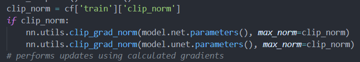

Dataloader

* Dataset_Gyro
  * csv中数据时间单位为nm
  
  * time_train 视频片段时间长度
  
  * number_train = time_train // sample_freq   sample_freq=40ms
  
  * process_one_video
    * LoadFrameData
      *usecols*=(5, 4, 1, 3, 5, 1, 0)
    
    * | ; frame_id | active_sensor_idx | frame_time | sensor_rolling_shutter_skew | exposure_time | sof         |
      | ---------- | ----------------- | ---------- | --------------------------- | ------------- | ----------- |
      | 909        | 0                 | 33333      | 16763                       | 6250          | 57113571653 |
      | 910        | 0                 | 33333      | 16763                       | 6250          | 57113604978 |
      | 911        | 0                 | 33333      | 16763                       | 6250          | 57113638304 |
      | 912        | 0                 | 33333      | 16763                       | 6250          | 57113671629 |
    
      sof - exposure_time/2 作为该frame曝光的中间时刻
      问题：1）时间单位是？col3-col5 *1000的意义是？2）col2是帧时间，col4是曝光时间，col3是啥？3)sof是曝光结束的时间点？
    
    * LoadGyroData
    
    * | 909  | 57113563059 | -0.092388436 | -0.135610059 | 0.007092984  |
      | ---- | ----------- | ------------ | ------------ | ------------ |
      | 909  | 57113565508 | -0.080782011 | -0.154546872 | 0.002206066  |
      | 909  | 57113567957 | -0.067953847 | -0.169207618 | -0.001459122 |
      | 909  | 57113570405 | -0.058790877 | -0.183257505 | -0.005735176 |
      | 909  | 57113572854 | -0.04840618  | -0.192420483 | -0.008789499 |
    
      *usecols*=(1, 2, 3, 4, 1, 0)
      数据对应 frame_id, time, 三个方向的角度
      1）角度顺序变换原因？
      quats_data，变换角度为四元数，quats_data[0]赋值[0,0,0,1]作为初始位置，后续角度转换为与初始位置的相对值。
    
    * LoadOISData 待定
    
    * load_real_projections：每一帧分成12行，根据gyro和ois参数，计算每一行对应的投影变换矩阵（3*3）

Train

* 

Net

* double_conv并没有实现
  class DoubleConv(nn.Module):

    """(convolution => [BN] => ReLU) * 2"""

  

    def __init__(*self*, *in_channels*, *out_channels*, *mid_channels*=None):

  ​    super().__init__()

  ​    *if* not mid_channels:

  ​      mid_channels = out_channels

  ​    self.double_conv = nn.Sequential(

  ​      nn.Conv2d(in_channels, mid_channels, *kernel_size*=3, *padding*=1),

  ​      nn.ReLU(*inplace*=True),

  ​    )

  

    def forward(*self*, *x*):

  ​    *return* self.double_conv(x)

* max_norm 类型为float

  
