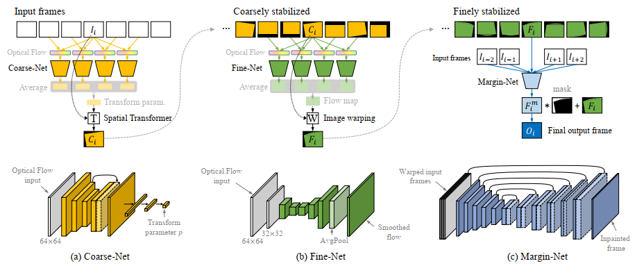
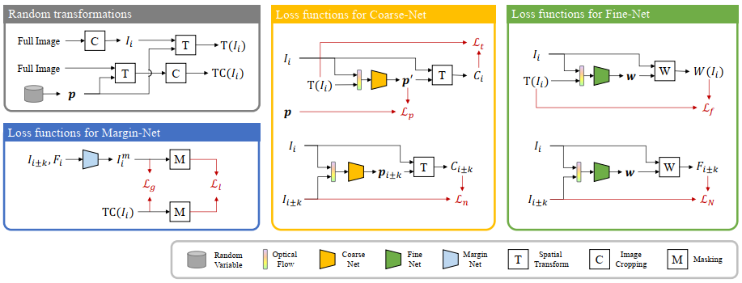
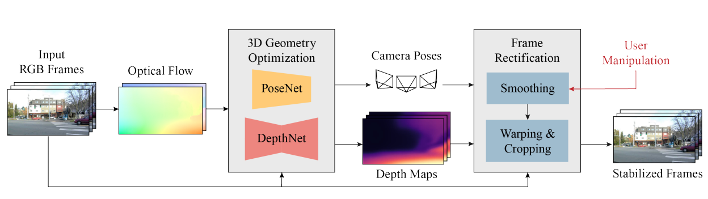
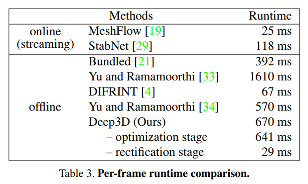

**Self-Supervised Real-time Video Stabilization** 2021

* takes approximately 24.3 ms yielding 41 fps regardless of resolution (e.g., 480p or 1080p)  
* coarse stabilizer, fine stabilizer, margin inpainter
* 等待supplement和code放出

**3D Video Stabilization with Depth Estimation by CNN-based Optimization**  2021

* 3D geometry optimization and frame rectification  
* test-time training

