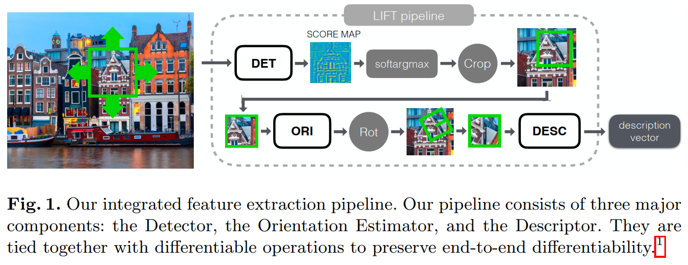
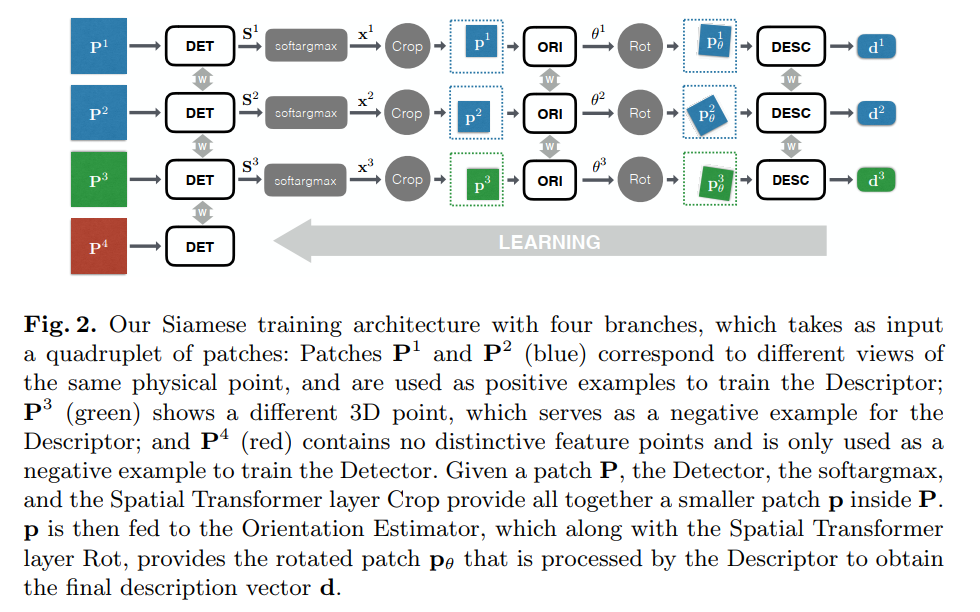
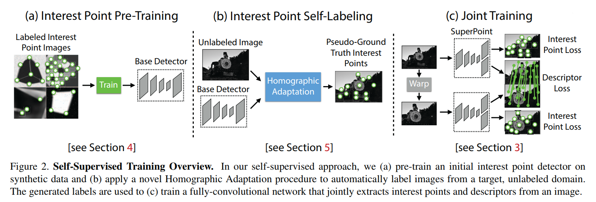
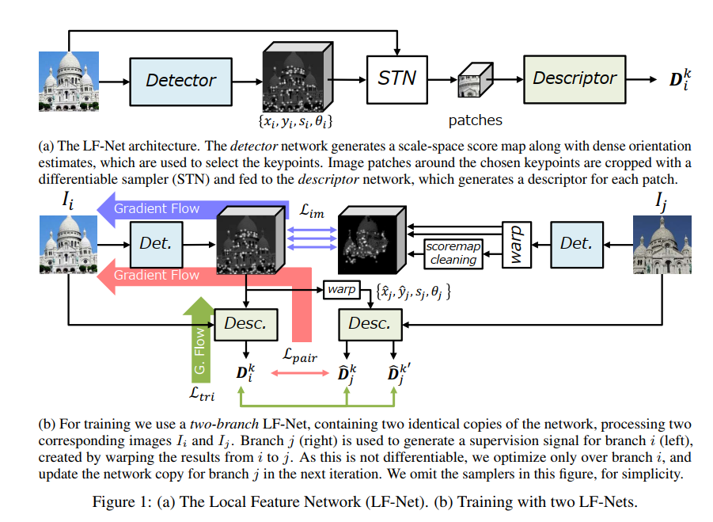
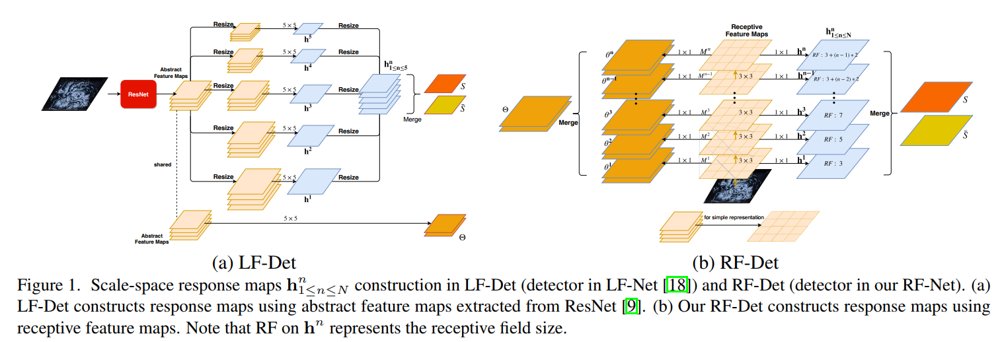
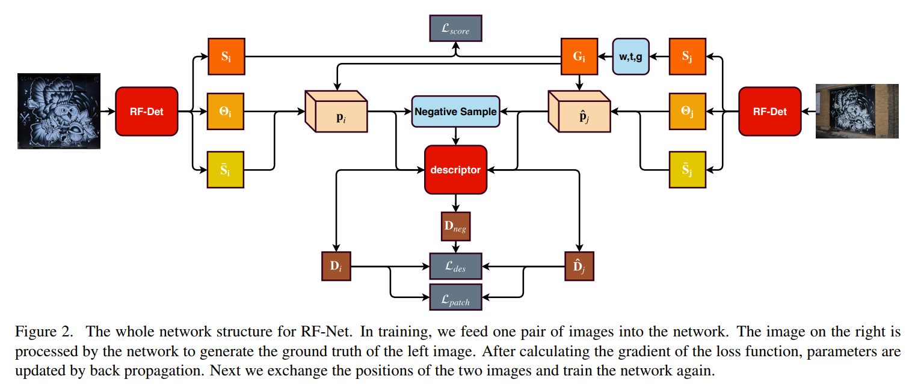
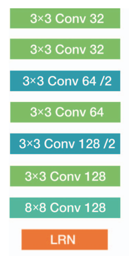

LIFT --> SuperPoint --> LF-Net --> RF-Net

* LIFT -- infer工作流组成：1) det 2) orientation 3) descriptor
  * 训练过程从后往前，先训后面的part，固定后训前面的
  * 训练样本为四元patch，$$P^1$$到$$P^4$$，P1,P2是来自同一个3D点在不同视角下的图像，P3是不同3D点投影回来的图像块，P4是不包含任何特征点的图像块
  * Desc训练使用P1,P2,P3，Ori训练使用P1,P2，Det使用所有

* SuperPoint: 1）合成数据集上训练MagicPoint；2）MagicPoint + Homographic Adaption生成pseudo ground truth；3）pseudo ground truth被用来训练SuperPoint

* LF-Net：1）无监督；2）detector预测x,y, orientation，scale（scale通过resize成N个scale（N=5）的feature map来实现）

* RF-Net
  * detector设计：基于感受野不同的feature map进行训练，Figure1(b)中RF maps的大小应该是一样的，感受野因为卷积深度变深而增大。
  * Descriptor结构与LF-Net相同
  * Description loss ：improve the hard loss by a neighbor mask  两个patch的质心距离超过阈值才认为是非匹配点对，用于计算$$D_{ng}$$

* 网络架构
  * detector
    * LF-Net利用ResNet得到feature map，通过resize得到不同尺度的响应图；RF-Net的假设是，不同深度的feature map感受野不同，感受野越大的feature map更适合预测大尺度的关键点。
    * 网络输出$$S$$为置信度图，预测关键点位置，$$\bar{S}$$为尺度map，$$\Theta$$为角度map，双通道分别预测sin和cos值。
  * descriptor
    * 根据detector的结果，根据关键点的位置，尺度和方向信息，从原图切对应大小的patch，并旋转到主方向，resize成32*32，进入descriptor网络，生成128维的特征输出。
  * 训练
    * detector，descriptor交替训练
    * 单应矩阵已知的两幅图像互相作为样本和GT进行训练
    * w.t.g操作  $$G_i=g(t(w(S_j)))$$， w--warp， t--选出置信度最高的K个点， g--在K个位置处卷积高斯核生成clean ground truth
  * loss
    * $$\mathcal L_{det}$$
      $$\mathcal L_{det}=\lambda_1 \mathcal L_{score}+\lambda_2 \mathcal L_{patch}$$
      $$\mathcal L_{score}(S_i, S_j)=\left| S_i-G_i \right|^2$$
      $$\mathcal L_{patch}(D_i^k, \hat{D}_j^k)=\frac{1}{K}\sum_{k=1}^Kd(D_i^k, \hat{D}_j^k) \qquad d(x,y)=\sqrt{2-2xy}$$
    * $$\mathcal L_{des}$$
      $$\mathcal L_{des}(\mathbb D_{pos}, \mathbb D_{ng})=\frac{1}{K}\sum \max(0, 1+\mathbb D_{pos}-\mathbb D_{ng})$$
      $$\mathbb D_{pos}(D_i^k, \hat{D}_j^k)=d(D_i^k, \hat{D}_j^k)$$
      $$\mathbb D_{ng}=\min (d(D_i^k, \hat{D}_j^{n}),d(D_i^m, \hat{D}_j^{k}))$$， 最近邻不匹配点的descriptor

LRN--局部响应归一化， 使其中响应比较大的值变得相对更大，并抑制其他反馈较小的神经元，增强了模型的泛化能力。后期其他文献认为作用不大
$$b_{x,y}^i=a_{x,y}^i/ \left( k+\alpha \displaystyle \sum_{j=\max(0,i-n/2)}^{\min(N-1,i+n/2)}(a_{x,y}^i)^2 \right)^\beta$$

