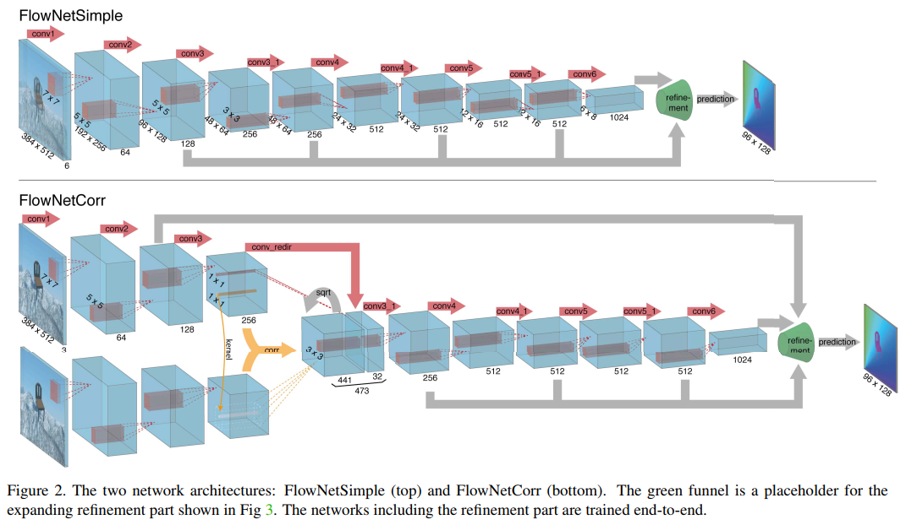
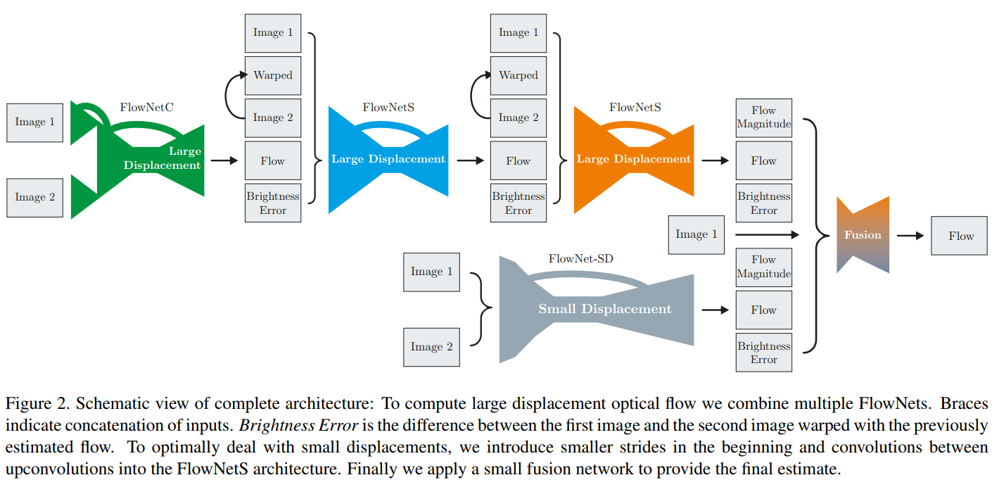
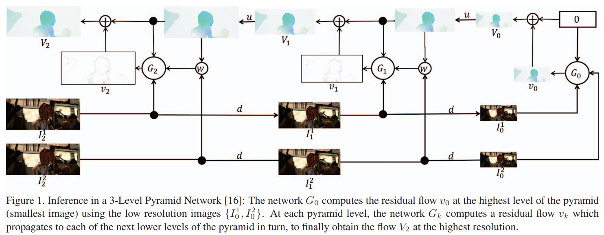
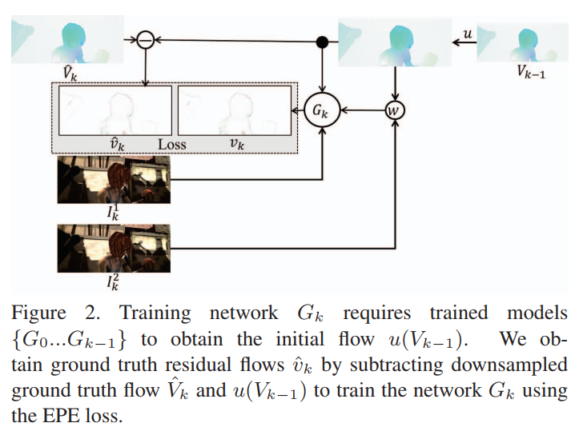
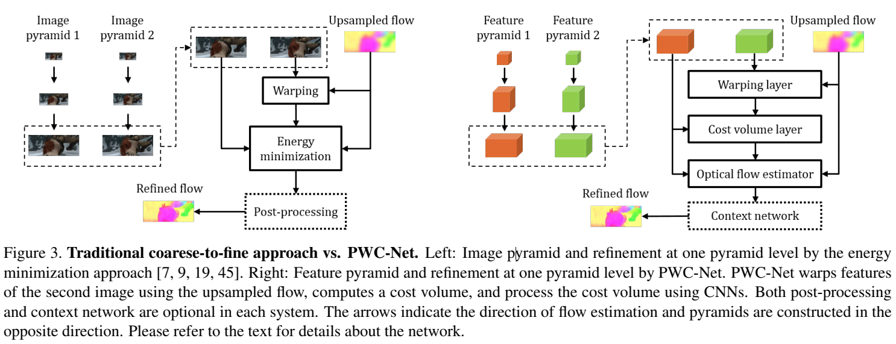
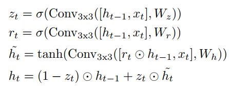
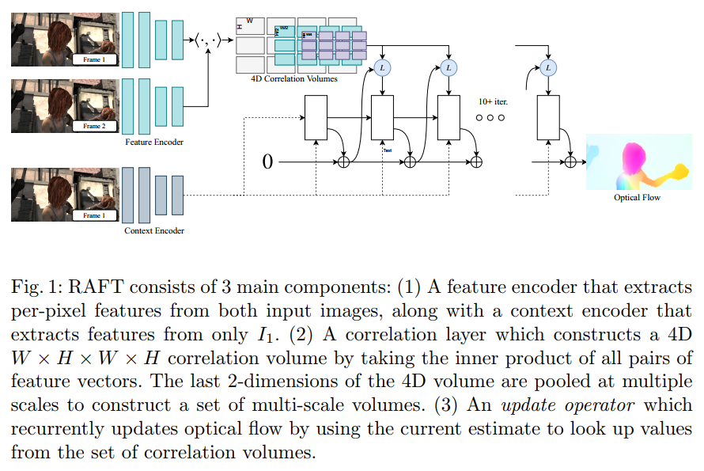
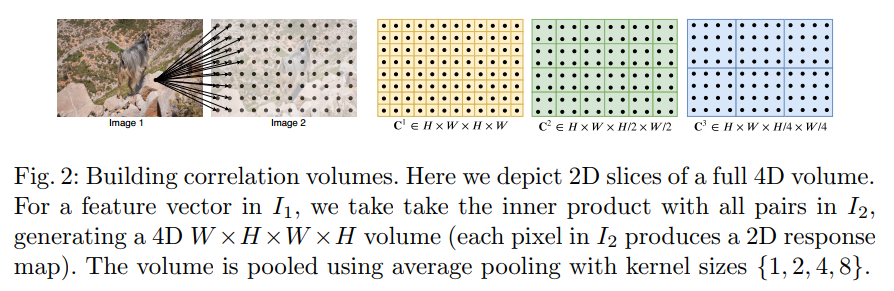

**FlowNet: Learning Optical Flow with Convolutional Networks**  FlowNetS and FlowNetC 2015

**FlowNet 2.0: Evolution of Optical Flow Estimation with Deep Networks**  FlowNet2 2017

* FlowNet网络的堆叠
* 平衡计算时间和精度的通道数调整
* 对FlowNet-S进行调整得到的FlowNet-SD：去掉第一层的stride=2；把7x7和5x5卷积核改成多个堆叠的3x3卷积核；反卷积添加额外的卷积层。FlowNet-SD为小位移分支网络

 **Optical Flow Estimation using a Spatial Pyramid Network**  SPyNet 2017

* 用 spatial pyramid 的方式，from coarse to fine 的方法来解决 large motion的问题
* FlowNet系列需要预测任意大的运动向量，SPyNet中pyramid的形式使每一个金字塔级的位移都在1个pixel左右，局部卷积就可以很好的预测。

**PWC-Net: CNNs for Optical Flow Using Pyramid, Warping, and Cost Volume**  2018

https://zhuanlan.zhihu.com/p/67302545

1. feature map比图像本身更鲁棒，PWC-Net learns feature pyramids  

2. 利用cost volume；use the features to construct a cost volume that stores the matching costs for associating a pixel with its corresponding pixels at the next frame **代价容量存储了两帧图像之间对应像素的匹配代价**

   金字塔第l层计算cost volume
   $$c_w^l(x)=c_2^l(x+up_2(w^{l+1})(x))$$

   $$cv^l(x_1, x_2)=\frac{1}{N}(c_1^l(x_1))^Tc_w^l(x_2)$$  对应位置的feature求归一化内积
   cost volume只需在有限区域中计算， $$\left| x_1-x_2 \right|_{\infin}\le d$$， 该层对应的cost volume大小为 $$d^2\times H^l \times W^l$$
   $$\left| x_1-x_2 \right|_{\infin}\le d$$

3. warping layer和 cost volume layer都是固定操作，无可学习参数；l

4. PWC-Net uses a context network to exploit contextual information to refine the optical flow；上下文信息提取利用了dilated convolutions；

5. running at about 35 fps on Sintel resolution (1024×436) images

6. Loss
   定义$$\Theta$$为网络的所有可学习参数，$$w_\Theta^l, w_{GT}^l$$分别为金字塔第l层的预测光流和金标准
   $$\mathcal L(\Theta)=\displaystyle \sum_{l=l_0}^L\alpha_l\sum_x \left| w_\Theta^l(x) - w_{GT}^l(x) \right|_2 + \gamma \left| \Theta \right|_2$$
   fine-tuning阶段，$$q\lt 1$$
   $$\mathcal L(\Theta)=\displaystyle \sum_{l=l_0}^L\alpha_l\sum_x (\left| w_\Theta^l(x) - w_{GT}^l(x) \right|+\epsilon)^q + \gamma \left| \Theta \right|_2$$

**RAFT: Recurrent All-Pairs Field Transforms for Optical Flow**  2020

* 类似PWC-Net级联金字塔的问题：低分辨率产生的错误无法在高分辨率层复原，在低分辨率层容易忽略小的快速移动对象。
* 100ms/frame，高分辨率下550ms/frame (1088*1920)
* novelty
  * 一种新的光流预测网络架构
  * 基于两帧图像的feature maps生成multi-scale 4D correlation volumes  
  * 构建GRU循环单元，根据当前flow在4D correlation volumes上查找对应特征区域，迭代式的更新flow
  * 光流更新保持在高分辨率图上，因此可以克服级联金字塔的问题
* Feature Extraction
  * $$g_\theta:\mathbb{R}^{H_0\times{W_0}\times{3}}\rightarrow{\mathbb{R}^{H\times{W}\times{D}}}$$， 其中$$H=H_0/8,W=W_0/8,D=256$$
* Computing Visual Similarity
  * correlation volume $$\pmb{C}$$
    $$g_\theta(I_1), g_\theta(I_2)\in{\mathbb{R}^{H\times{W}\times{D}}}$$
    $$\pmb{C}(g_\theta(I_1), g_\theta(I_2))\in{\mathbb{R}^{H\times{W}\times{H}\times{W}}}$$，  $$C_{ijkl}=\displaystyle\sum_hg_\theta(I_1)_{ijh}\cdot{g_\theta(I_2)_{klh}}$$
  * correlation pyramid
     4-layer pyramid  {$$\pmb{C}^1,\pmb{C}^2,\pmb{C}^3,\pmb{C}^4$$}，$$\pmb{C}^k\in{\mathbb{R}^{H\times{W}\times{H/2^k}\times{W/2^k}}}$$
  * correlation lookup
    在迭代更新过程中，利用当前flow $$(\pmb{f}^1,\pmb{f}^2)$$，得到$$I_1$$上点$$\pmb{x}=(u,v)$$在 $$I_2$$上的对应点$$\pmb{x^{'}}=(u+f^1(u),v+f^2(v))$$，定义其邻域为
    $$\mathcal{N}(\pmb{x^{'}})_r=\{\pmb{x^{'}}+\pmb{dx}|\pmb{dx}\in{\mathbb{Z}^2},\left\|\pmb{dx}\right\|_1\leq{r}\}$$
    找到不同尺度下r范围内的correlation volume的值，叠加为correlation特征
* Iterative Updates
  * GRU cell
    
    其中 $$x_t$$为光流，correlation特征图，context features 的叠加
* Loss
  $$\mathcal{L}=\displaystyle\sum_{i=1}^N\gamma^{N-i}\left\|\pmb{f}_{gt}-\pmb{f}_i\right\|_1$$
  $$\gamma=0.8$$

